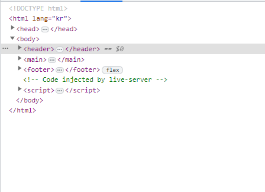
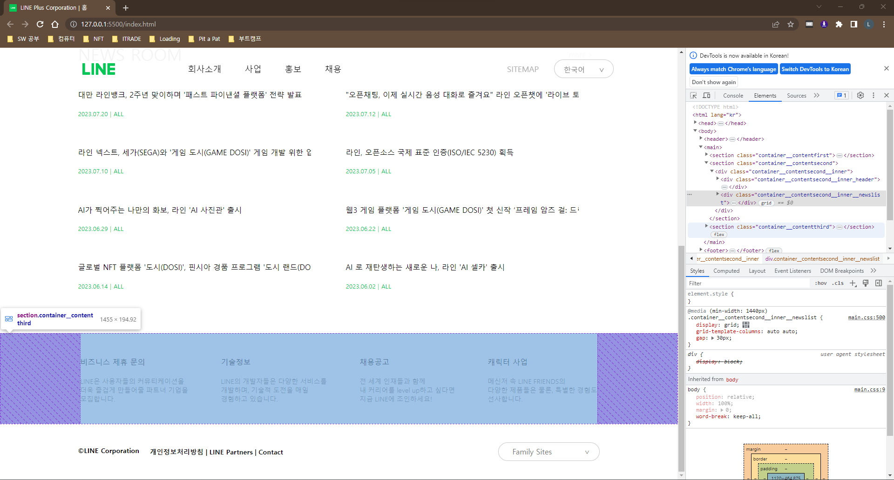
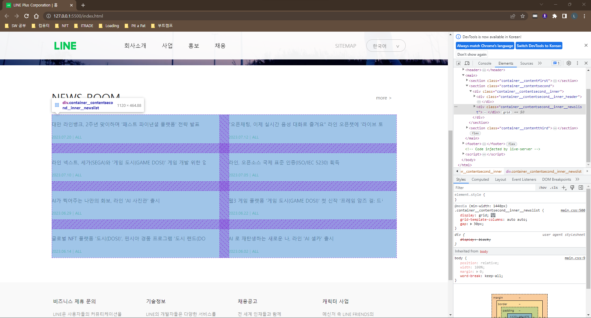
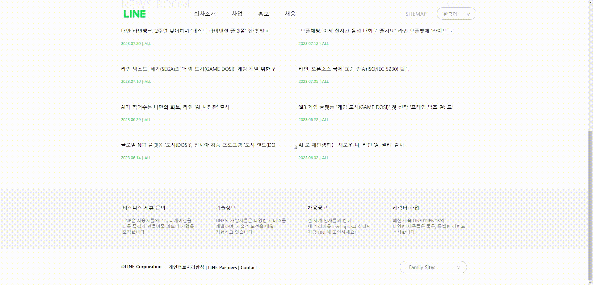

***

# LINE plus+ 클론 코딩 (FE 박성후)
### 안녕하세요!
클론코딩한 사이트는 라인플러스(주)입니다. 
원본 사이트 : https://linepluscorp.com/ 입니다. 
배포 사이트 : 입니다.
 
 

# 구현해본 기능
## 1. 시멘틱 태그  

 

## 2. Flex, Grid 사용 

 

## 3. 드롭박스 

 

## 4. 반응형 

 

## 4. 태국어 사이트 이동 

 
 

# 실습 후 느낀 점
> ### 학습내용
>> 구조를 해부하는데 시간이 오래 걸렸지만, 더 깊이 이해할 수 있었습니다. 
>> 앞으로 배울 자바스크립트를 조금씩 구현해보면서 감을 익혔습니다.
 

> ### 개선점
>> 구조 분석과 CSS에 대한 이해가 부족해서 반응형 웹을 제대로 완성하지 못했습니다. 
>> 재사용하지 못하고 계속 반복되는 코드를 개선하지 못했습니다.

***
