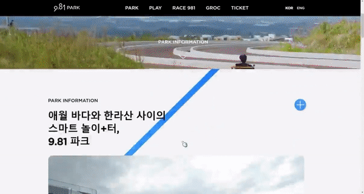

# 🚗9.81 파크 클론코딩

제주도 여행에서 갔다온 9.81파크의 사이트가 생동감 넘쳐 마침 구현해보게 되었습니다! 다들 가보셨나요? 제주도 여행 계획이 있으시다면 추천합니다

## 링크

- 클론 사이트: https://www.981park.com/
- 배포 사이트: https://astounding-malasada-b18c4b.netlify.app/

## 구현 모습

## 요구사항

### 필수 요구사항

- [x] 과제에 대한 설명을 포함한 README.md 파일을 제공하세요!
- [x] 과제 결과와 비교할 수 있는 실제 사이트(페이지)의 주소를 명시하세요!
- [x] 과정에서 사용한 프로젝트 폴더/파일이 모두 포함돼야 합니다, 일부 파일만 제출하지 마세요!
- [x] 실제 서비스로 배포하고 접근 가능한 링크를 추가해야 합니다.

### 선택 요구사항

- [x] < header >, < section > 등 시멘틱 태그를 최대한 활용해보세요.
- [x] 실제 사이트의 레거시 코드 활용보단 최신의 CSS Flex 혹은 Grid 등을 활용해보세요.
- [x] 부분적으로 BEM 방법론을 도입해보세요.
- [x] JS가 필요한 부분은 되도록 생략하되 이유를 명시해보세요.(CSS로 대체 가능한지 피드백이 있을 수 있겠죠?!)
  - 버튼을 눌렀을 때 카드가 넘어가는 부분 (배너)
- [x] JS가 필요한 부분 중 구현할 부분이 있다면 자유롭게 구현해보세요.(JS 과제가 아니니까 가볍게 구현하시길 추천해요)
  - 카드에 hover했을 때 내부에 있는 text나 button의 색이 한번에 바뀌어야 하는 부분에서 js를 사용했습니다.
- [ ] SCSS 등의 CSS 전처리도구를 도입해보세요.
- [ ] SCSS 컴파일에 Webpack이나 Parcel 같은 번들러를 활용해보세요.

## 아쉬운 점

- 제주도 여행을 24일에 시작해서 27일 밤 11시쯤에 집에 도착해 시간이 모자라 구현하지 못하고 놓친 부분이 몇몇 있어 시간이 많았다면 충분히 고민해볼 수 있을텐데 하는 아쉬움이 많이 남습니다ㅎㅎ
  - 티켓 부분에서 버튼을 눌렀을 때 카드가 넘어가는 부분
  - nav를 완벽하게 구현하지 못한 부분
  - css 깔끔한 정리

## 느낀점

평소 사이트를 만들 때 img를 배치해 background로 사용할 생각을 해본 적이 없었는데 이런 방식을 처음으로 사용해보았는데, 자유롭고 화려하게 사이트를 구성할 수 있는 것 같아 신기했습니다.
