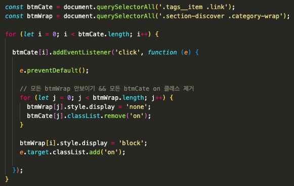
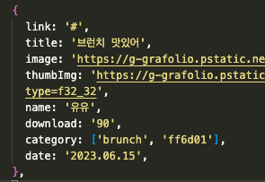
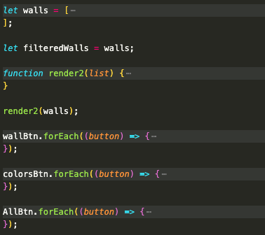

## 프로젝트 개요
HTML, CSS, JS 를 활용하여 자신이 원하는 페이지를 선정해 클론 코딩하는 프로젝트입니다.

## 사이트 링크
- 클론 사이트 : https://grafolio.naver.com/wallpaper.grfl
- 배포 사이트 : http://grafolio.dothome.co.kr/main/main.html

## 화면 미리보기

## 구현 상세 내용
- scss 에서 변수 선언, @include 를 활용하여 반복되는 구문을 재사용했습니다.
- 모바일, 태블릿 사이즈에도 적용될 수 있도록 반응형 구현을 했습니다. 
- 배열 함수인 map, filter, some 을 활용하여 카테고리 필터링을 구현했습니다.

## 사용한 스택

## 피드백 받고 싶은 부분
"자바스크립트로 버튼, 필터의 기능을 넣다 보니 줄이 매우 길어지고 반복되는 부분도 많고 비효율적이라고 많이 느껴졌습니다. 리팩토링이 필요한 부분 그리고 어떻게 리팩토링하는 것이 좋은지 조언 듣고 싶습니다!!"

## 오류 및 서치로 알게된 부분
1. 2중 for문 
같은 클래스를 가진 여러 개의 버튼을 클릭했을 때, 해당 버튼만 활성화되고 나머지 버튼은 비활성화 시키는 것을
2중 for 문으로 활용 가능하다는 것을 알게 되었습니다.

2. 객체 date 표기법 
객체 속성 중 date 부분에 'YY.MM.DD' 라고 표기했었는데 'invalid Date' 오류가 떠서
new Date() 사용해서 객체를 생성할 때는 'YYYY.MM.DD' 이 형식을 지켜야 한다는 것을 알게 되었습니다.

3. 공유되는 배열은 처음에 선언하기 
아래 3개의 버튼을 누를 때마다 walls 에서 필터된 배열을 만들어냈는데
그 배열을 담은 변수를 어떻게 서로 공유하지 싶다가 애초에 필터링 될 배열을 선언해 주고 
이벤트 일어날 때마다 재할당하면 된다는 것을 알게 되었습니다.

