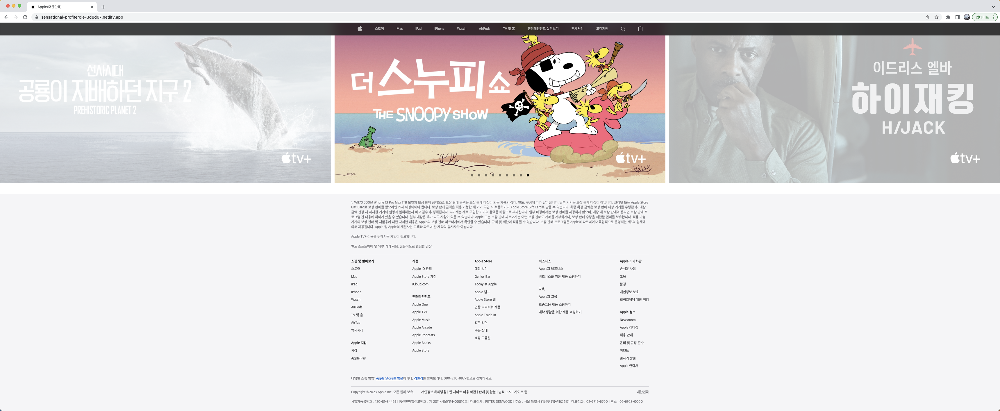

# 인터파크 홈페이지 클론코딩

## 사이즈 주소

`클론한 사이트`  
https://www.interpark.com/

`데모링크`

## 기술 스택

### 개발환경

### 언어

## 구현한 내용

-   Flex를 이용하여 이미지, 링크, 버튼 등을 정렬
-   JS는 사용하지 않고 HTML, CSS로만 구현

### 헤더

-   페이지 스크롤시 상단 고정

### 자동 슬라이드 컨텐츠

#### 1. 화면 상단

-   Animation 기능을 이용해 자동 슬라이드 기능 구현
-   좌우 슬라이드 버튼 기능 미구현
-   좌 -> 우 로 무한 슬라이드

#### 2. 화면 하단

-   Animation 기능을 이용해 자동 슬라이드 기능 구현
-   좌 -> 우 슬라이드 후 제일 끝 이미지에서 다시 첫 이미지로 우 -> 좌로 슬라이드

### 메인 컨텐츠 탭 기능

-   탭 버튼 클릭시 해당 div의 z-index값을 변경시켜주는 방식으로 탭 기능 구현
-   좌우 슬라이드 버튼 기능 미구현

### 이외 메인 컨텐츠 화면 구현

### Footer

## 느낀 점

처음 목표는 JS까지 이용하여 메인 화면에서의 기능은 대부분 구현하는 것이었는데,
화면 구현하는데 생각보다 시간이 많이 걸려 JS로 구현할 부분은 결국 하지 못하고 반응형 등도 구현하지 못해 아쉽다.
CSS를 효율적으로 작성하여 재사용이 간편하게 하려고 하였으나 중간에 코드가 꼬이기도 하여 결국 class 남발이 된거 같아 아쉬움이 남습니다.
많은 연습을 통해 원래 사이트 참고 없이도 구현이 가능할 수 있도록 노력해야겠습니다.
