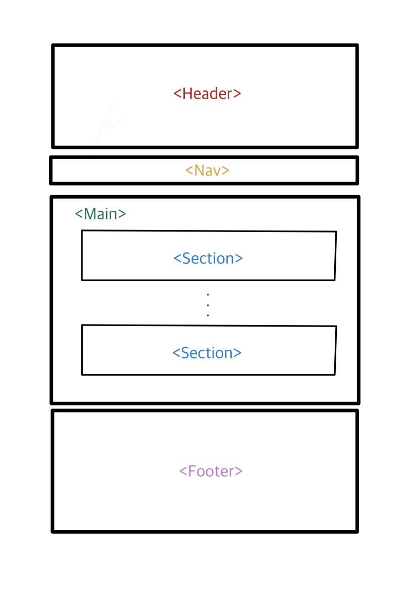

# HTML CSS 클론코딩 과제
--------------------------

## 실제 사이트 주소
https://kream.co.kr/
## 클론코딩 사이트 주소

---------------------------
## 프로젝트 소개
-----------------------------
KREAM 사이트를 클론코딩하여 만든 사이트입니다.
## [프로젝트 구조]
-----------------------
프로젝트 구조는 다음과 같습니다

전체적인 구조는 다음과 같이 Header, Nav, Main, Footer로 구성되어 있습니다.
또한 Main 부분에서 각 기능 별로 Section으로 나누었습니다.

## [프로젝트 구조]
-------------
단순한 HTML과 CSS를 사용하여 만든 반응형 웹 사이트입니다. 
최대한 순수 CSS를 사용해보고 익히고 싶어서 라이브러리나 번들러를 아예 제외하고 제작하였습니다.
따라서 광고 배너를 JS가 아닌 CSS animation, keyframe을 사용해 제작해 보았습니다. 

HTML을 작성할 때는 최대한 시멘틱 태그를 활용하여 각 요소들의 의미에 맞게 마크업 하였습니다.

또한 Flex, Grid를 적극 활용하여 아이템들을 유연하게 배치하려고 노력했습니다.

실제 웹사이트와 거의 흡사한 사이즈를 위해 화면의 padding과 margin을 최대한 비슷하게 조정하였습니다.

또한 class와 id를 적극 활용하여 CSS의 재사용성을 높였습니다. 

