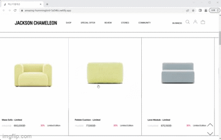
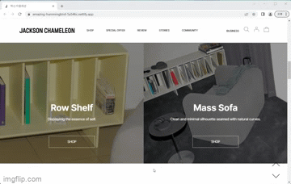

## 클론한 사이트

잭슨카멜레온 : https://jacksonchameleon.co.kr/
 
 

## 프로젝트 사이트

https://amazing-hummingbird-5a546c.netlify.app/

 

## 제작기간

2023.07.25 ~ 2023.07.28

 

## 구현한 내용

### 1. 헤더 애니메이션

 
 
   

- 스크롤에 반응 
  : Lodash 라이브러리를 통한 함수 실행 제어 
  : gsap 라이브러리를 통한 애니메이션 효과 

- 호버에 반응 
  : vanilaJS 
  : 하위 클래스를 통해 상위 클래스의 속성을 제어하기 위해 JS사용 
  : 스크롤이 상단에 위치했을 때만 호버에 반응

   

### 2. 이미지 전환 및 슬라이더 구현

 

   

- 호버 시 이미지 전환 
  : CSS 

- 슬라이더 
  : Swiper 라이브러리 사용 

 

### 3. 섹션 등장 효과 구현

 

   

- 스크롤에 반응 
  : Lodash 라이브러리를 통한 함수 실행 제어 

- CSS의 transform과 opacity 속성 사용 

 

### 4. 버튼 및 글자 효과 구현

   

- CSS 
  : before 선택자를 통한 효과 구현 

 

## 느낀점 및 개선할 사항

코드를 깔끔하게 짜는 것이 어려웠었다. 처음 만들다보니 계획을 어떻게 세우고 시작해야될지 몰라 무작정 만들기 시작했더니 시행착오를 많이 겪었다. 다음에는 이번 과제를 하며 겪었던 시행착오를 양분삼아 더 깔끔하게 제작할 수 있을 것 같다 :)  

#### 개선할 사항 

- 마지막 섹션인 Review에서 swiper를 활용하여 숫자 버튼을 가진 슬라이더 제작 
- class명 수정 
- JS 코드 개선
