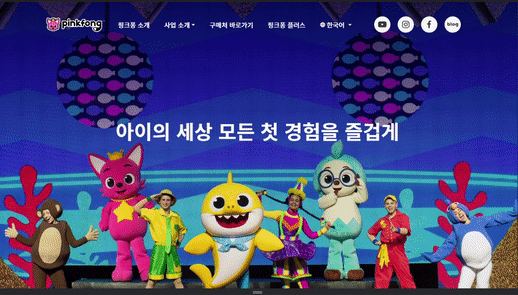
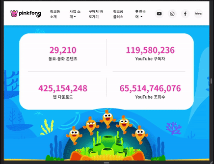
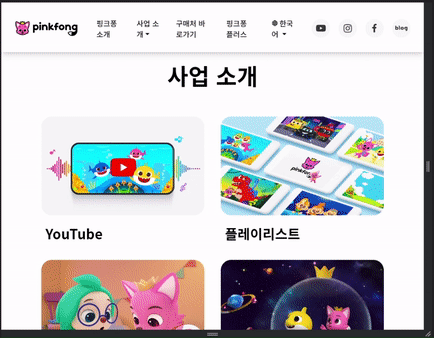
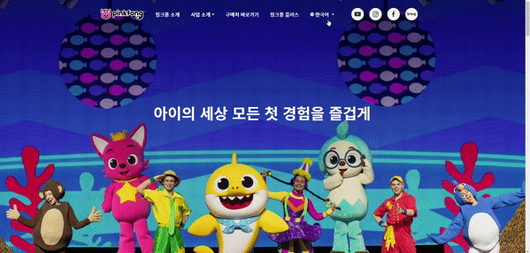
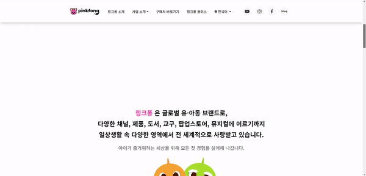
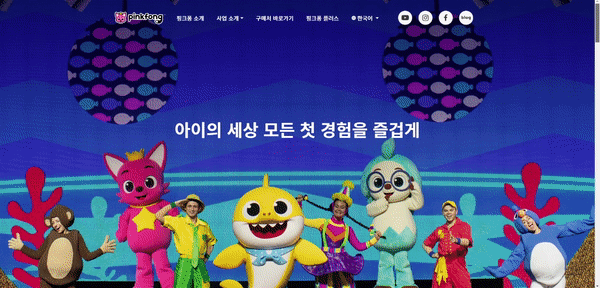
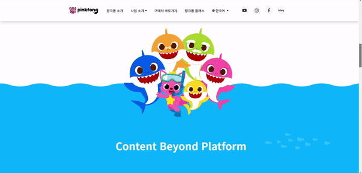

# 핑크퐁 공식 웹사이트 클론코딩 과제
HTML, CSS과제의 주제로 핑크퐁 공식 웹사이트의 메인페이지 클론코딩을 진행하였습니다. 
## 사이트 주소
실제 사이트 : https://www.pinkfong.com/ko/

과제 사이트 : ...

## 과제 설명

- 기존 홈페이지가 스크롤에따라 요소가 움직이는것들이 많아서 최대한 비슷하게 만들어 봤습니다.
<br>

```
1. css의 미디어 쿼리와 display: grid속성을 사용하여 반응형으로 만들어 봤습니다.
```
  


  

<br>

```
2. 헤더는 display: flex 속성과 position: absolute 속성을 통해 메인 리스트와 하위 리스트를 구성을 하였고,
   반응형으로 넓이가 좁아지면 사이드바 형식으로 나타나도록 하였습니다.
```

   

<br>

```
CSS의 position: sticky 를 활용하여 요소가 원하는 위치에서 스크롤이 가능하도록 하였습니다.
```



<br>

```
3. 자바스크립트의 스크롤 이벤트를 활용하여 메인페이지 첫 배경과 헤더의 색상이 바뀌도록 만들었고,
   바닷속의 물방울이 스크롤에 따라서 움직이도록 만들었습니다.

   또한 자바스크립트 과제는 아니지만 간단하게 요소가 화면에 보이면 반응할 수 있도록
   intersection Observer API를 활용하여 요소의 투명도의 변화를 주었습니다.
```
   




