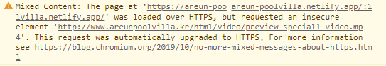

# KDT0_KimSeongKyeom

### 🎯 프로젝트 개요

실제 사이트 : [http://www.areunpoolvilla.kr/html/index.html](http://www.areunpoolvilla.kr/html/index.html)

완성 사이트 : [https://areun-poolvilla.netlify.app](https://areun-poolvilla.netlify.app)

> **HTML/CSS 과제를 위한 클론 프로젝트 입니다.**  
> 저작권 등의 이유로 영상 및 이미지가 다른 미디어 파일로 대체될 수 있습니다.  
> 또한 운영중인 사이트에 피해가 가지 않도록 검색엔진 수집을 제한합니다.

```html
<meta name="robots" content="noindex,nofollow" />
```

### 클론 선정 이유

[gdweb](https://www.gdweb.co.kr/main/) 을 통해 알게 된 사이트 입니다.  
다른 수상작 사이트에 비해 JS로 구현된 기능이 비교적 적고  
CSS Grid와 Flex를 사용하여 구현 해볼 수 있을것같아서 선정하게 되었습니다.

## 주요 구현 사항

1. HTML/CSS 를 사용하여 메인 페이지 PC/Laptop/Tablet/Mobile 반응형을 구현
1. JS가 필요한 상황에는 필수적이라고 판단되는 기능의 경우 구현
   1. 네비게이션 메뉴의 경우 필수적이라는 판단이 들어 구현했습니다.
   1. 실제 사이트의 경우 스크롤 애니메이션을 넣지 않으면 아에 안보이는 글자가 있어 제한적으로 라이브러리를 사용하여 구현하였습니다.
   1. 슬라이더 역시 필수적이라고 판단이 들어 구현 하였습니다.

### ✔️ 필수 요구사항 체크리스트

- [x] 과제에 대한 설명을 포함한 README.md 파일 작성
- [x] 실제 사이트 주소 명시
- [x] 과정에서 사용한 프로젝트 폴더,파일 KDT0_KimSeongKyeom 브랜치에 업로드
- [x] netlify를 사용하여 배포 후 클론 사이트 주소 명시

### ⭕ 선택 요구사항 체크리스트

- [x] 시멘틱 태그를 최대한 사용해보기
- [x] 부분적으로 CSS Grid 와 CSS Flex 사용하여 레이아웃
- [x] BEM 방법론 사용해보기
- [x] JS가 꼭 필요한 부분에는 간단하기 구현
- [x] SCSS 전처리 도구 도입
- [x] Parcel bundler를 사용하여 SCSS 컴파일

### 반응형 Break points

| 기기   | 너비            |
| ------ | --------------- |
| PC     | 1400px~ 이상    |
| Laptop | 1024px ~ 1399px |
| Tablet | 768px ~ 1023px  |
| Mobile | ~767px 이하     |

### 실제 사이트 비교 시 미구현 사항

netlify로 배포 시 `https`로 배포되지만  
실제 사이트의 주소는 `http`로 되어있어  
동영상을 실제 사이트의 서버에서 불러오면  
`Mixed Content` 오류로 인해 불러 오지 못하여 정지 이미지로 대체했습니다.

  


## 프로젝트 상세 설명

**BEM 방법론**

개인적으로는 부모 자식 관계를 파악하기 쉽다고 느껴졌고,  
규칙이 있기 때문에 네이밍을 짓는데 시간이 덜 소요된것같았습니다.  
또한 겹치는 class 명이 생기기가 어려운 방식이라  
더 편리하다고 생각이 들어서 사용 하였습니다.  
<br/>

**브라우저 리렌더링 최소화**

`width`나 `position` 등등 이 변경되면 **Reflow, Repaint**가 일어나게 되기 때문에  
되도록 이면, 가상으로 요소의 크기나 위치를 변경하는 `transform` 을 사용하였습니다.  
<br/>

**빠른 개발을 위한 번들러 사용**

세세한 설정을 하지 않아도 간단히 사용 가능한 [Parcel 번들러](https://parceljs.org/)를 이용하였습니다.  
css 작성 시간을 줄이고 유지보수가 용이한 코드 작성을 위해서  
SCSS(SASS)를 사용하여 CSS를 작성했습니다.  
<br/>

**사용한 라이브러리**

- 헤더와 타이틀 글씨 애니메이션을 위하여 [gsap](https://greensock.com/gsap/) 를 사용 하였습니다.
- 최상단 메인 비주얼등에 슬라이더를 적용하기 위해서 [Swiper](https://swiperjs.com/) 를 사용 하였습니다.
  <br/><br/>

**즉시실행함수(IIFE) 사용**

아래와 같은 이유로 인해 즉시 실행 함수를 사용하여 JS 코드를 작성 하였습니다.

1. 라이브러리 전역 변수 충돌 방지
1. 캡슐화를 위해
1. window, docuemnt 객체를 더 짧게 사용하기 위함
