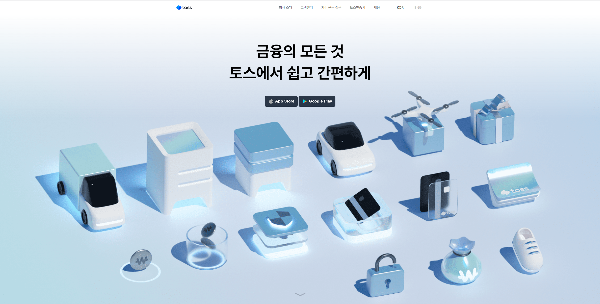
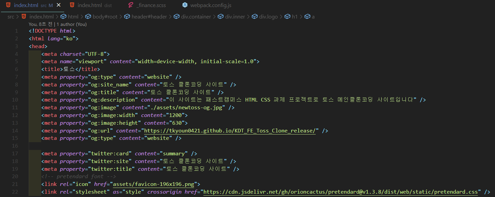
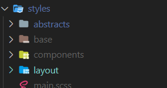
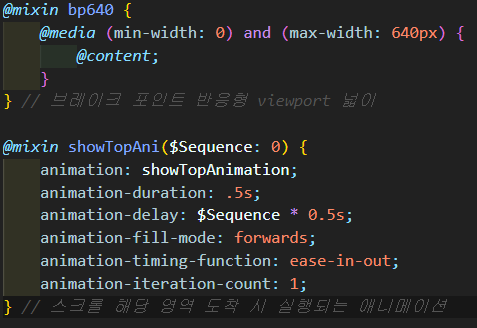
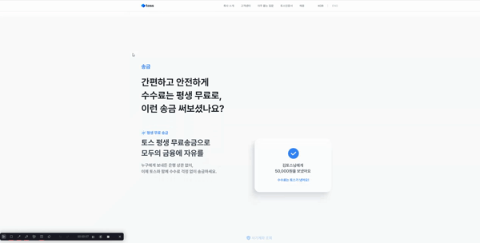

# 토스 클론코딩 프로젝트
이 프로젝트는 `패스트캠퍼스X야놀자 프론트엔드 부트캠프
첫번째 과제 HTML CSS 과제`입니다.  
토스 **메인 페이지를 카피하여** `HTML,SCSS,Javascript`을 사용하여 반응형으로 제작하였습니다.

## 프로젝트 사이트 주소
원본 사이트 URL: <a href="https://toss.im/">https://toss.im/</a>  
클론 사이트 URL: <a href="https://tkyoun0421.github.io/KDT_FE_Toss_Clone_release/">https://tkyoun0421.github.io/KDT_FE_Toss_Clone_release/</a>

## 프로젝트 설명
토스 메인페이지를 HTML CSS Javascript를 사용하여 제작한 클론 코딩 프로젝트입니다.
 
 

### HTML 
  
 
메타 태그를 작성하여 SEO 검색엔진 최적화를 통해 사이트의 검색 엔진에 상위에 노출될 수 있게끔 하였고, 시맨틱 태그를 사용하여 해당 요소가 어떤 역할을 하는지 알 수 있게 웹 표준을 지켜서 마크업하였습니다.

### CSS(SCSS)

 
 
CSS의 전처리기인 SCSS를 사용하여 CSS의 사용 용도별로 폴더를 구조화 하여 설계 했습니다.  
<strong>abstracts</strong>폴더는 프로젝트 전체에서 사용하는 기능인 믹스인, 변수 기능들과 애니메이션 키프레임을 모아두었습니다.  
<strong>base</strong>폴더는 공통적으로 CSS가 필요한 부분이나 reset과 글꼴 같은 HTML 요소의 표준 스타일들을 모아두었습니다.
<strong>components</strong>폴더는 프로젝트 전체에 작은 구성요소로 재사용이 가능한 컴포넌트들의 css를 모아두었습니다.  
<strong>layout</strong>폴더는 HTML section 별로 나누어서 모아두었습니다.

### JS

 
 
바닐라 자바스크립트를 사용하여 DOM 탐색을 통해 요소를 선택하고 클래스를 탈부착하는 형식으로 CSS로 구현이 가능한 동적 요소들은 최대한 CSS를 활용하여 작성하였습니다. intersection observer api를 사용하여 해당 요소에 도착할 때 마다 클래스를 붙여서 요소가 나타나는 애니메이션을 만들었습니다.

## 프로젝트 기간
2023.07.24 ~ 2023.07.26

## Developer
Name | Github URL | Blog URL |
-- | -- | -- |
**윤태관(Front-end)** | https://github.com/tkyoun0421 | https://dev-taegwan.tistory.com/ 

## 기술 스택

