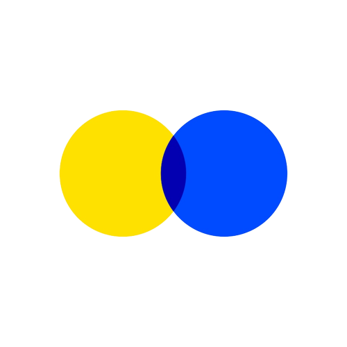

# <strong>🌱LINE 홈페이지 클론 코딩</strong>

3주차 HTML/CSS 클론 코딩 과제로 라인을 선정하였습니다.

 

## <strong>선정 이유</strong>

사이트 내 애니메이션 등을 구현 도전해보고 싶어서 선정하였습니다.
 
 

## <strong>기술 스택</strong>

- HTML
- CSS
- JavaScript
  - Lodash
  - Gsap
     
     

  
 

## <strong>실제 웹사이트 / 클론 코딩 바로가기</strong>

 

| 라인 서비스 주소                        | 클론 코딩 링크                                                    |
| --------------------------------------- | ----------------------------------------------------------------- |
| [라인 서비스 주소](https://line.me/ko/) | [라인 클론 코딩 주소](https://playful-eclair-e2793a.netlify.app/) |

 

## <strong>자바스크립트가 쓰인 부분</strong>

- 로딩 애니메이션
- 배너 애니메이션
- 스크롤에 따른 배너 축소 애니메이션
- 스크롤에 따른 헤더 현재 위치 변경
- 서비스 카테고리 별 분류 기능
