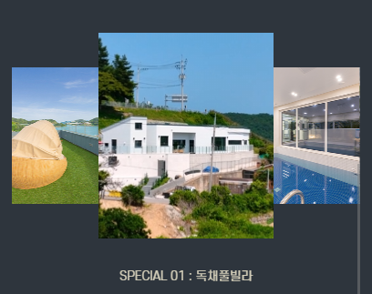

# KDT0_KimSeongKyeom

### 🎯 프로젝트 개요

실제 사이트 : [http://www.areunpoolvilla.kr/html/index.html](http://www.areunpoolvilla.kr/html/index.html)

완성 사이트 : [https://areun-poolvilla.netlify.app](https://areun-poolvilla.netlify.app)  
서브 페이지 : [https://areun-poolvilla.netlify.app/sub.html](https://areun-poolvilla.netlify.app/sub.html)

> **HTML/CSS 과제를 위한 클론 프로젝트 입니다.**  
> 저작권 등의 이유로 영상 및 이미지가 다른 미디어 파일로 대체될 수 있습니다.  
> 또한 운영중인 사이트에 피해가 가지 않도록 검색엔진 수집을 제한합니다.

```html
<meta name="robots" content="noindex,nofollow" />
```

### 클론 선정 이유

[gdweb](https://www.gdweb.co.kr/main/) 을 통해 알게 된 사이트 입니다.  
다른 수상작 사이트에 비해 JS로 구현된 기능이 비교적 적고  
CSS Grid와 Flex를 사용하여 구현 해볼 수 있을것같아서 선정하게 되었습니다.

## 주요 구현 사항

1. HTML/CSS 를 사용하여 메인 페이지 PC/Laptop/Tablet/Mobile 반응형을 구현
1. JS가 필요한 상황에는 필수적이라고 판단되는 기능의 경우 구현
   1. 네비게이션 메뉴의 경우 필수적이라는 판단이 들어 구현했습니다.
   1. 실제 사이트의 경우 스크롤 애니메이션을 넣지 않으면 아에 안보이는 글자가 있어 제한적으로 라이브러리를 사용하여 구현하였습니다.
   1. 슬라이더 역시 필수적이라고 판단이 들어 구현 하였습니다.

### ✔️ 필수 요구사항 체크리스트

- [x] 과제에 대한 설명을 포함한 README.md 파일 작성
- [x] 실제 사이트 주소 명시
- [x] 과정에서 사용한 프로젝트 폴더,파일 KDT0_KimSeongKyeom 브랜치에 업로드
- [x] netlify를 사용하여 배포 후 클론 사이트 주소 명시

### ⭕ 선택 요구사항 체크리스트

- [x] 시멘틱 태그를 최대한 사용해보기
- [x] 부분적으로 CSS Grid 와 CSS Flex 사용하여 레이아웃
- [x] BEM 방법론 사용해보기
- [x] JS가 꼭 필요한 부분에는 간단하기 구현
- [x] SCSS 전처리 도구 도입
- [x] Parcel bundler를 사용하여 SCSS 컴파일

### 반응형 Break points

| 기기   | 너비            |
| ------ | --------------- |
| PC     | 1400px~ 이상    |
| Laptop | 1024px ~ 1399px |
| Tablet | 768px ~ 1023px  |
| Mobile | ~767px 이하     |

### 실제 사이트 비교 시 미구현 사항

netlify로 배포 시 `https`로 배포되지만  
실제 사이트의 주소는 `http`로 되어있어  
동영상을 실제 사이트의 서버에서 불러오면  
`Mixed Content` 오류로 인해 불러 오지 못하여 정지 이미지로 대체했습니다.

  


## 프로젝트 상세 설명

**BEM 방법론**

개인적으로는 부모 자식 관계를 파악하기 쉽다고 느껴졌고,  
규칙이 있기 때문에 네이밍을 짓는데 시간이 덜 소요된것같았습니다.  
또한 겹치는 class 명이 생기기가 어려운 방식이라  
더 편리하다고 생각이 들어서 사용 하였습니다.  
  
<br/>

**브라우저 리렌더링 최소화**

`width`나 `position` 등등 이 변경되면 **Reflow, Repaint**가 일어나게 되기 때문에  
되도록 이면, 가상으로 요소의 크기나 위치를 변경하는 `transform` 을 사용하였습니다.  

<br/>

**빠른 개발을 위한 번들러 사용**

세세한 설정을 하지 않아도 간단히 사용 가능한 [Parcel 번들러](https://parceljs.org/)를 이용하였습니다.  
css 작성 시간을 줄이고 유지보수가 용이한 코드 작성을 위해서  
SCSS(SASS)를 사용하여 CSS를 작성했습니다.  

<br/>

**사용한 라이브러리**

- 헤더와 타이틀 글씨 애니메이션을 위하여 [gsap](https://greensock.com/gsap/) 를 사용 하였습니다.
- 최상단 메인 비주얼등에 슬라이더를 적용하기 위해서 [Swiper](https://swiperjs.com/) 를 사용 하였습니다.
  <br/><br/>

**즉시실행함수(IIFE) 사용**

```javascript
// 즉시 초기화 함수를 실행합니다.
(function (w, d) {
  // 윈도우의 컨텐츠가 로드 되면 아래 스크립트들을 실행합니다.
  w.addEventListener("DOMContentLoaded", (event) => {
    const header = d.getElementById("header");
    const navImgs = Array.from(
      d.querySelectorAll(".main-navigation__img-list > li")
    );
    const navItems = Array.from(d.querySelectorAll(".menu-item"));
    const hamberger = d.getElementById("hamberger-btn");
    let isOpen = false;

    // ...
  });
})(window, document);
```

---

## 😊 과제를 통해 배운 점

### 번들러 사용 + scss사용

`parcel` 번들러를 사용하여 css, js 파일들을 한 번에 번들링해서 최적화 할 수 있었던 점이 재미있었습니다. 덕분에 css로 작성했으면 오래 걸리고 지루했을 작업을 scss(sass) 방식으로 작성하였습니다. 장점이 많은 scss를 사용하니 더 효율적이고 기분 좋은 개발 경험을 했던것같습니다.

`webpack`으로 하면 더 세세한 설정이 가능하겠지만 그만큼 배워야할것도 많아서 boilerplate를 찾아 다녔어야 했는데, `parcel`로 간단하게 시작해보는것도 괜찮을것같다고 생각이 들었습니다.

scss를 한 줄로 정리하자면 **효율성,시간 단축**이 키워드 인것같습니다.

### CSS Grid 레이아웃 사용

Flex 레이아웃을 익혔다면 생각보다 매우 이해하기 쉽고 간단했는데, 왜 이제까지 잘 안 써보았는지 후회될정도로 너무 편하고 좋은 기능이라는점을 깨달았습니다.

특히 `grid-area`이름을 지정하고 `grid-template-areas`를 사용하는 경험은 정말 신기하면서도 실용적인 기능이라서 많은 분들이 도전해보았으면 하는 생각이 들었습니다.

### 즉시실행(IIFE) 함수 사용

처음에는 왜 굳이 이렇게 사용하는것일까.. 하는 생각만 하고 공부해보려는 생각은 못했었습니다..

물론 즉시실행함수를 쓰지 않아도 충분히 좋은 코드를 쓸수있겠지만, 여러 가지 장점이 있다는 것이 알게 되어서 전역변수들을 초기화할 일 이 있다면 꼭 써보자는 생각도 하게 되었습니다.

주로, 한 번만 실행되는 초기화 함수를 실행할때 많이 사용되기 때문에 꼭 익혀놓아야 겠습니다.

**즉시실행 함수의 장점**

- 한 번만 실행되는 초기화 함수
- 전역 스코프에 불필요한 변수를 추가해서 오염시키는 것을 방지
- 코드의 캡슐화가 가능
- 코드의 난독화를 할 수 있습니다.

## 😢 아쉬운 점

**번들러 사용법 숙지가 아쉽.**  
parcel 번들러의 경우 제대로 공식문서를 다 보지 않고, 블로그 글을 보고 따라해서 하다보니 자세하게 번들파일의 이름 규칙을 바꿔본다던지.. 여러가지 시도를 해보지 못한것이 아쉬웠습니다.

**제대로된 scss는 아직 더 배울필요가 있다.**  
css를 작성할때는 최대한 중복되는 코드나 이름을 줄여야 할텐데 아직 scss가 익숙치 않아서 효율적으로 작성했다기 보다는 변수를 사용해서 복붙을 좀 줄였다는 것, 중첩기능을 사용해서 코드가 조금 줄었다는것에 의미를 둬야 했던점이 아쉽다고 생각했습니다.

**미숙한 javascript 실력**  
아직 제대로 javascript 코드를 짜본건 아니고 강의 들은것이 전부이기 때문에, 즉시실행함수(IIFE)도 제대로 썼다고 보기 어렵고, 맛보기로만 실행만 되는지 확인한 수준이였던것같아 아쉬웠습니다.
